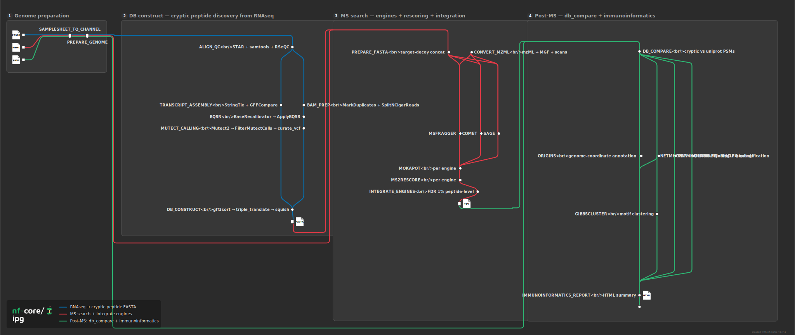

# sanjaysgk/ipg

[](https://github.com/sanjaysgk/ipg/actions/workflows/ci.yml)
[](https://www.nf-test.com)
[](https://www.nextflow.io/)
[](https://pixi.sh)
[](https://sylabs.io/docs/)
[](LICENSE)

## Introduction

**sanjaysgk/ipg** is a bioinformatics pipeline for **immunopeptidogenomics**: it builds a personalised **cryptic peptide search database** from RNA-seq, then searches it against immunopeptidomics MS/MS data to identify non-canonical (cryptic) peptides. It implements the method of [Scull et al. (2021)](https://doi.org/10.1016/j.mcpro.2021.100143) as a reproducible [nf-core](https://nf-co.re)-style Nextflow pipeline.



The pipeline runs in independent steps selected with `--step`:

**`--step db_construct` — RNA-seq → cryptic peptide FASTA**

1. Align reads with two-pass [STAR](https://github.com/alexdobin/STAR) and infer strandedness with [RSeQC](http://rseqc.sourceforge.net/).
2. Assemble transcripts with [StringTie](https://ccb.jhu.edu/software/stringtie/) and reconcile with the reference annotation via [gffcompare](https://ccb.jhu.edu/software/stringtie/gffcompare.shtml).
3. GATK4 RNA-seq best-practice BAM preparation (MarkDuplicates → SplitNCigarReads → two-pass BQSR).
4. Call somatic variants with [Mutect2](https://gatk.broadinstitute.org/) in tumour-only mode.
5. Build the cryptic peptide database with the IPG custom C tools (`curate_vcf`, `alt_liftover`, `triple_translate`, `squish`).

**`--step ms_search` — MS/MS → identified cryptic peptides**

6. Search each sample's spectra against its cryptic database with [MSFragger](https://msfragger.nesvilab.org/), [Comet](https://uwpr.github.io/Comet/) and [Sage](https://github.com/lazear/sage).
7. Rescore PSMs with [MS2Rescore](https://github.com/compomics/ms2rescore) + [mokapot](https://github.com/wfondrie/mokapot) FDR and integrate engines at 1% peptide-level FDR.
8. _Optional_ **de novo** discovery lane (`--run_denovo`, [InstaNovo](https://github.com/instadeepai/InstaNovo)) — predicts peptides directly from spectra and classifies them canonical / cryptic / novel.
9. _Optional_ immunoinformatics (HLA binding, motif clustering, quantification) and a cryptic-discovery report.

## Usage

> [!NOTE]
> New to Nextflow? See the [nf-core installation docs](https://nf-co.re/docs/usage/installation). The repository ships a [pixi](https://pixi.sh) environment that pins every tool — install it with `pixi install` (`curl -fsSL https://pixi.sh/install.sh | bash` if you don't have pixi).

Prepare a samplesheet:

**samplesheet.csv**

```csv
sample,fastq_1,fastq_2,strandedness
SAMPLE,/path/to/R1.fastq.gz,/path/to/R2.fastq.gz,reverse
```

Build the cryptic peptide database:

```bash
pixi run nextflow run . \
    -profile singularity \
    --step db_construct \
    --input samplesheet.csv \
    --outdir results \
    -params-file reference.yaml
```

> [!WARNING]
> Provide parameters via the CLI or a `-params-file`, not via a custom `-c` config file.

To try the pipeline on the bundled chr22 test data, run with `-profile test,pixi`. For the full reference-genome parameters, the MS-search samplesheet, the `--step ms_search` and `--step post_ms` workflows, and all options, see [`docs/usage.md`](docs/usage.md).

## Pipeline output

- **Database construction:** `results/db_construct/<sample>/<sample>_cryptic.fasta`
- **MS search:** the integrated peptide table under `results/ms_search/<sample>/`
- A [MultiQC](http://multiqc.info/) report and Nextflow execution reports under `results/pipeline_info/`

See [`docs/output.md`](docs/output.md) for the full output description.

## Profiles

| Profile                  | Purpose                                                        |
| ------------------------ | ------------------------------------------------------------- |
| `pixi`                   | Run every tool from the local pixi env (no containers)        |
| `singularity` / `docker` | Pull biocontainers (HPC / cloud)                              |
| `monash`                 | SLURM on the Monash M3 `comp` partition (`xy86` account)      |
| `test`                   | Use the bundled chr22 test data                               |

## Credits

`sanjaysgk/ipg` was written by **Sanjay SG Krishna** ([@sanjaysgk](https://github.com/sanjaysgk)), Li Lab, Monash University, porting the immunopeptidogenomics method and custom C tools developed by **Kate Scull** (Purcell Lab; [kescull/immunopeptidogenomics](https://github.com/kescull/immunopeptidogenomics)). Supervised by **Chen Li** (Li Lab) and **Anthony W. Purcell** (Purcell Lab), Monash University.

## Contributions and support

Contributions are welcome via [issues and pull requests](https://github.com/sanjaysgk/ipg).

## Citations

If you use `sanjaysgk/ipg`, please cite the method paper:

> Scull KE, Pandey K, Ramarathinam SH, Purcell AW. _Immunopeptidogenomics: harnessing RNA-seq to illuminate the dark immunopeptidome._ Mol Cell Proteomics. 2021;20:100143. doi:[10.1016/j.mcpro.2021.100143](https://doi.org/10.1016/j.mcpro.2021.100143)

A reference list for every tool in the pipeline is in [`CITATIONS.md`](CITATIONS.md). This pipeline is built with [Nextflow](https://www.nextflow.io) and the [nf-core](https://nf-co.re) framework (Ewels _et al._, _Nat Biotechnol._ 2020, doi:[10.1038/s41587-020-0439-x](https://doi.org/10.1038/s41587-020-0439-x)).

## License

MIT — see [LICENSE](LICENSE).
